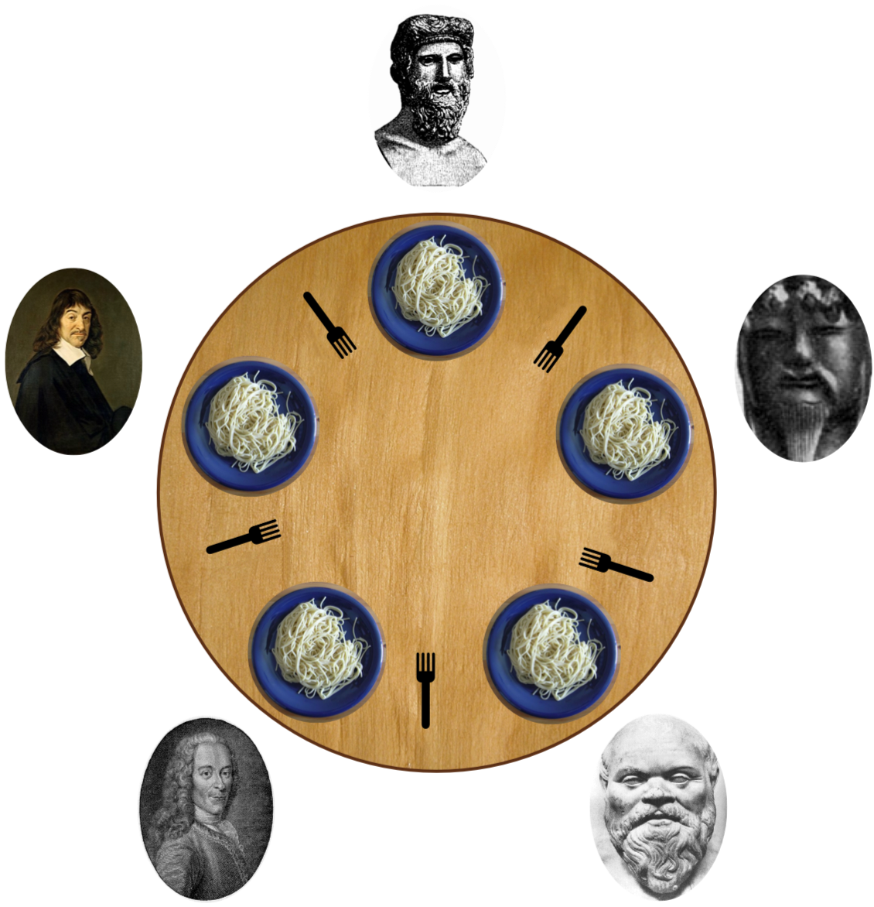

# Philosophers

This project is a reproduction of the dining philosophers problem and introduces us to the concept of concurrency, threads and the sharing of computer resources.  



# Context

The story behind this project could be told as follow:

- Five philosophers dine together at the same table.
- Each philosopher has their own plate at the table which contains spaghetti.
- Each philosophers has 1 fork, but must use 2 forks in order to eat his meal, one on his right and one on his left.
- Each philosophers must either eat, think or sleep. They are not allowed to do nothing, else they die.
- Each action must be done alternatively.
- When a philosophers eats, he puts down his fork that becomes for another philosophers to eat.

Therefore, this project is a design project, in which each philosopher actions must be coordinated to make sure that each is doing something. 

## Usage

Here are the instructions in order to compile the program:

| Command | Usage |
| --- | --- |
| `make` | Compiles program and creates executable ./philo
| `make clean` | Removes all object files (.o) of project and from libft
| `make fclean` | Removes all objects files (.o), all .a along with executable ./philo
| `make re` | Removes all objects (.o) files and executable and recompiles them

The program is executed as follows and takes 4 or 5 arguments. The last argument is optional as it specifies the number of times a philosophers must eat before the programs ends. 

```shell
./philo <nb_of_philosophers> <time_to_die> <time_to_eat> <time_to_sleep> <nb time must eat>
```	
Here is a concrete example:

```shell
./philo 4 500 200 200
```	

## Project Rules 

* Each philosopher should be a thread.
* There is one fork between each pair of philosophers. Therefore, if there are several
philosophers, each philosopher has a fork on their left side and a fork on their right
side. If there is only one philosopher, there should be only one fork on the table.
* To prevent philosophers from duplicating forks, you should protect the forks state
with a mutex for each of them.
